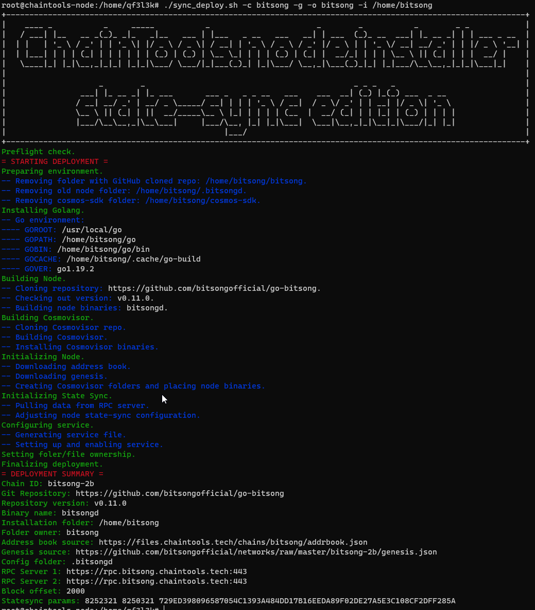

# state-sync node deployment script


## Pre-requisites
Before running deployment script make sure following tools are installed/available in the system:
 - jq
 - git
 - wget

Before installing node make sure user and home folder is created for particular node and then proper detailes are passed to script during execution.


## Script usage

Script deploys full chain node and configures statesync parametera as in chain profile.

Usage parameters: 
```bash
sync_deploy.sh -c <chain_name> -i <destination_folder> -o <service_owner> [-g]

Options:
   -c chain_name               name of chain configuration file, which will be used for deployment;
   -i destination_folder       folder where node will be installed (eg. /home/juno);
   -o service_owner            user and group which will be set on files and folders in destination;
   -g                          specifies, if golang should be installed;
```
In case of any questions contact support@chaintools.tech


## Expample execution



## ToDo
- [ ] pre-flight : user check/creation
- [ ] pre-flight : check required tools and install if missing (jq, build-essential)
- [ ] deployment : prunning settings added to config and applied to app.toml
- [ ] deployment : state-sync configuration as an option (that will make script able to deploy full node with snapshot)
